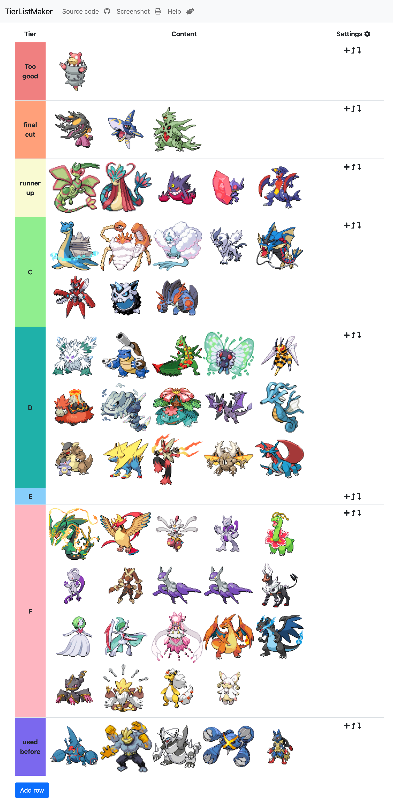

# TierListMaker

A fun side-project to make tier lists in your browser.

## Features

- drag-to-upload (one or more images)
- drag and drop images between tiers to reorder them
- drag and drop images within a tier to reorder inside of a tier
- change the color of a given tier
- stretch (to a square) or not an image when uploading it using the `+`
- export as an image
- everything stays in your browser, nothing is uploaded to the server: you keep your data
- dynamic tier names
- dark mode

## Getting Started

1. [Download the source code found on this page](https://github.com/SocksTheWolf/TierListMaker/releases/latest)

2. Unzip the downloaded file.

3. Drag and drop the `index.html` file from the folder into your browser.

4. Start tier listing!

## Screenshots

(This is of the old version)

